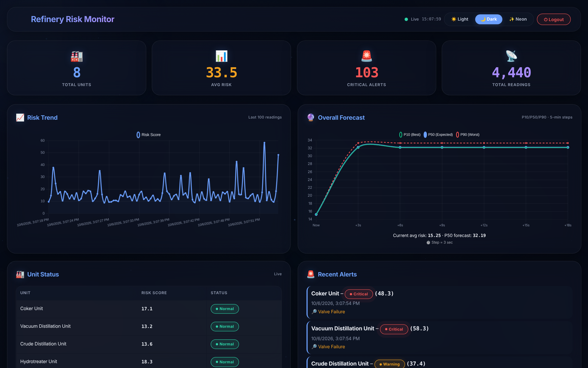
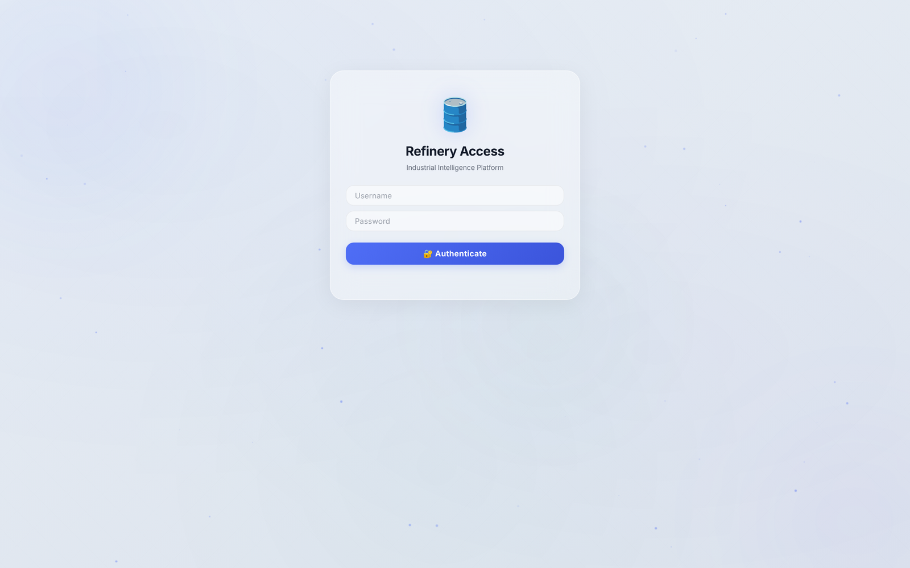
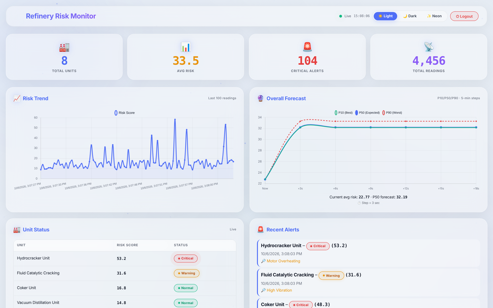
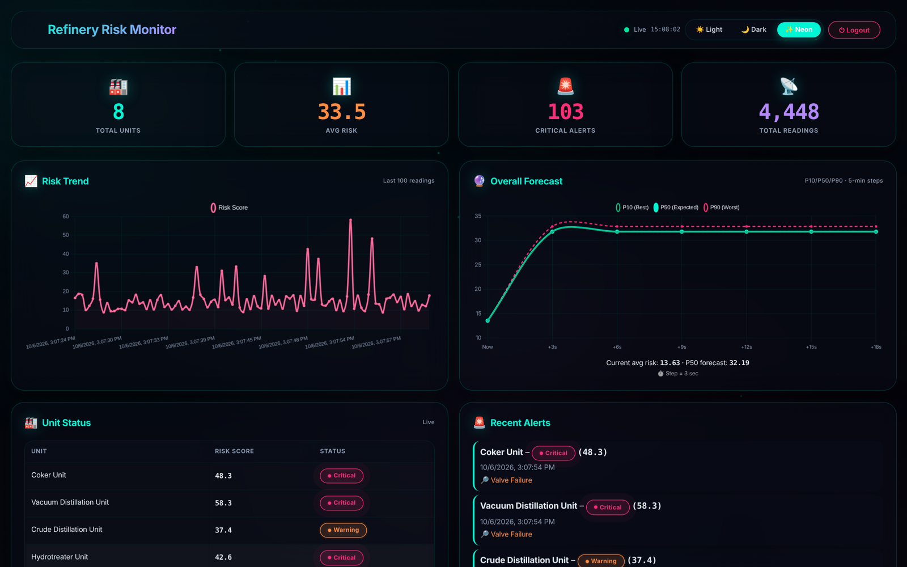
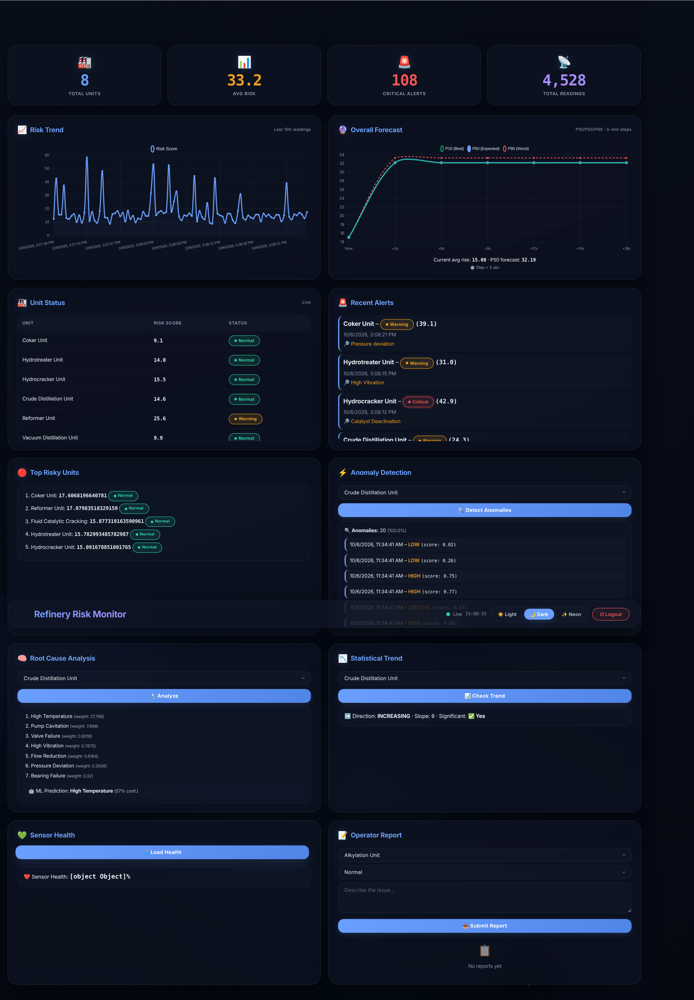
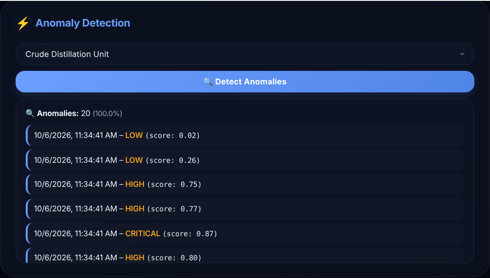
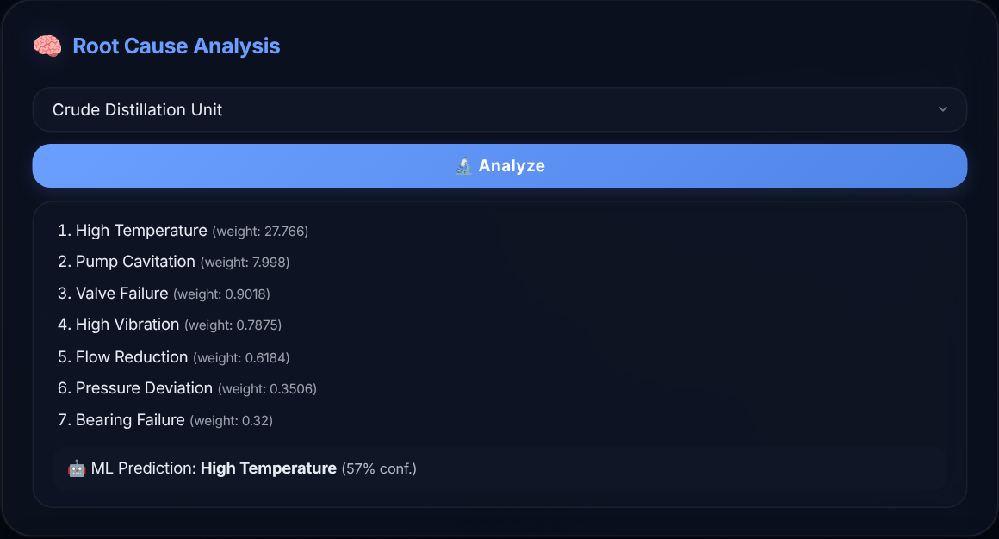
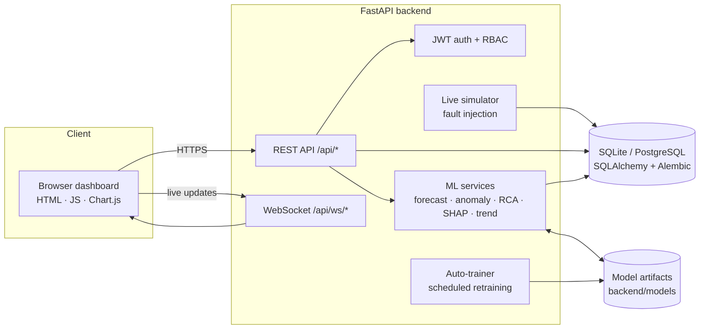

<div align="center">

# Refinery Risk Monitor

**AI-powered risk assessment and live monitoring for refinery process units.**

Real-time risk scoring · P10/P50/P90 forecasting · anomaly detection · root-cause analysis · explainable AI

[](https://www.python.org/)
[](https://fastapi.tiangolo.com/)
[](https://www.sqlalchemy.org/)
[](#machine-learning)
[](LICENSE)

</div>



## Overview

Refinery Risk Monitor watches the main process units of a refinery (crude distillation, FCC, hydrocracker, reformer and more), turns raw sensor streams into a single **risk score** per unit, forecasts where that score is heading, flags abnormal behaviour, and explains *why* a unit is at risk so operators can act early.

It is a complete platform rather than a notebook: a FastAPI backend, a database layer with migrations, a set of ML services with scheduled retraining, WebSocket live updates, role-based access control and a browser dashboard.

> **Project Lead:** [Sepehr Khasto](https://github.com/sepehrkhasto). I led this project end to end: product scope, system architecture, the ML pipeline design and the delivery of the platform.

## Screenshots

| Sign in | Light theme |
|---|---|
|  |  |

| Neon theme | Full dashboard |
|---|---|
|  |  |

| Anomaly detection | Root-cause analysis |
|---|---|
|  |  |

*Screenshots are taken from the running application with simulated plant data.*

## Features

- **Live risk monitoring.** Eight process units are scored continuously. KPI cards, a risk trend chart, a unit status table and an alert feed update in real time over WebSockets.
- **Probabilistic forecasting.** Per-unit quantile models predict the P10 (best case), P50 (expected) and P90 (worst case) risk path, so you see the uncertainty and not only a point estimate.
- **Anomaly detection.** An ensemble of Isolation Forest, One-Class SVM and Local Outlier Factor flags unusual sensor behaviour with a severity level and score.
- **Root-cause analysis.** Ranks likely causes (high temperature, pump cavitation, valve failure, bearing failure and so on) and adds an ML prediction with its confidence.
- **Explainable AI.** SHAP explanations show which sensors drive a unit's risk.
- **Trend analysis.** Mann-Kendall trend tests, seasonality detection, change-point detection (`ruptures`) and short-term forecasting.
- **Pattern mining.** FP-Growth association rules find sensor conditions that tend to appear together before incidents.
- **Sensor health and correlation.** Track sensor quality and cross-sensor correlation.
- **Operator reports.** Operators log observations per unit; engineers review them.
- **Stress testing.** Admins can run a cascade-failure simulation to see how the system reacts.
- **Role-based access.** `operator`, `engineer` and `admin` roles with JWT authentication.
- **Three themes.** Light, dark and neon.

## Architecture



```
backend/
├── api/            FastAPI app and routers (dashboard, predictions, analysis, root_cause,
│                   monitoring, auth, reports, simulate, websocket, health)
├── auth/           Password hashing, JWT, role checks
├── db/             SQLAlchemy models, schemas, CRUD
├── services/       ML and domain services (predictor, anomaly detector, RCA, SHAP,
│                   trend analyzer, apriori, simulator, auto-trainer)
├── websocket/      Connection manager and periodic risk broadcast
└── config.py       Environment-based settings
alembic/            Database migrations
frontend/           Dashboard (index.html) and admin panel (admin.html)
scripts/            create_admin, train_advanced_models, reset_env
```

## Machine learning

| Capability | Approach |
|---|---|
| Risk forecasting | Per-unit quantile models (P10/P50/P90); a stacking ensemble of XGBoost, LightGBM, CatBoost, Random Forest and Gradient Boosting with time-series cross-validation |
| Anomaly detection | Ensemble of Isolation Forest, One-Class SVM and Local Outlier Factor |
| Root cause | Weighted cause ranking plus a predictive classifier per unit |
| Explainability | SHAP |
| Trend analysis | Mann-Kendall, seasonality detection, change points (`ruptures`), forecasting |
| Pattern mining | FP-Growth association rules |
| Lifecycle | `scripts/train_advanced_models.py` for initial training; a background auto-trainer schedules retraining |

Models are generated at runtime and are not committed to Git.

## Quick start

Requires **Python 3.12** (the pinned scientific stack does not ship wheels for Python 3.13 yet).

```bash
git clone https://github.com/sepehrkhasto/refinery-risk-monitor.git
cd refinery-risk-monitor

python3.12 -m venv venv
source venv/bin/activate            # Windows: venv\Scripts\activate
pip install -r requirements.txt
```

Create a `.env` file (the default in `.env.example` points to PostgreSQL; for a zero-setup run use SQLite):

```env
ENVIRONMENT=development
DATABASE_URL=sqlite:///./refinery_risk.db
SECRET_KEY=change-me
CORS_ORIGINS=http://localhost:8080
LOG_LEVEL=INFO
```

Prepare the database, create a user and train the models:

```bash
alembic upgrade head
python scripts/create_admin.py            # interactive: username, password, role
python scripts/train_advanced_models.py   # generates sample data and trains all models (~30 s)
```

Start the backend and the dashboard:

```bash
uvicorn backend.api.main:app --reload --port 8000     # API
cd frontend && python -m http.server 8080              # dashboard
```

| What | URL |
|---|---|
| Dashboard | http://localhost:8080/index.html |
| Admin panel | http://localhost:8080/admin.html |
| Interactive API docs (Swagger) | http://localhost:8000/api/docs |
| ReDoc | http://localhost:8000/api/redoc |
| Health check | http://localhost:8000/api/health |

Sign in with the user you created. The simulator starts with the server and produces live data automatically.

> The dashboard talks to `http://localhost:8000/api` (set by the `API` constant in `frontend/index.html`). Change it there if you deploy the backend elsewhere.

## API at a glance

All routes are under `/api`. Full, interactive documentation is at `/api/docs`.

| Area | Endpoints |
|---|---|
| Dashboard | `GET /stats`, `/data`, `/top-risky`, `/status-distribution`, `/alerts`, `/heatmap`, `/units` |
| Forecasting | `GET /predict/overall`, `/predict/{unit}`, `/predict/ml/{unit}`, `/predict/accuracy/{unit}`, `/trend/{unit}` |
| Analysis | `GET /anomalies/{unit}`, `/shap/{unit}`, `/apriori`, `/root-cause/top`, `/root-cause/predict`, `/root-cause/complete` |
| Monitoring | `GET /timeline`, `/sensor-health`, `/correlation`, `/ohlc/{unit}` |
| Reports | `POST /operator-report`, `GET /operator-reports` |
| Simulation | `POST /simulate/cascade` (admin) |
| Auth | `POST /auth/login-json`, `/auth/register`, `/auth/logout`; admin user management |
| Live | `WS /ws/{unit}` |
| Health | `GET /health`, `/health/ready`, `/health/live` |

## Security

- JWT authentication and bcrypt password hashing.
- Role-based access control (`operator` < `engineer` < `admin`) enforced per endpoint.
- Configuration through environment variables; secrets, databases and trained models are git-ignored.
- In `production` mode the app refuses to start with a default `SECRET_KEY` or a wildcard `CORS_ORIGINS`.
- Request logging with correlation IDs and structured JSON logs.

## Configuration

| Variable | Default | Description |
|---|---|---|
| `ENVIRONMENT` | `development` | `production` enables strict secret and CORS validation |
| `DATABASE_URL` | `sqlite:///./refinery_risk.db` | SQLite or PostgreSQL connection string |
| `SECRET_KEY` | development key | JWT signing key. Set a strong value in production |
| `ACCESS_TOKEN_EXPIRE_MINUTES` | `60` | Token lifetime |
| `CORS_ORIGINS` | `*` | Comma-separated allowed origins |
| `PREDICTION_STEP_SECONDS` | `3` | Forecast step (3 s for demo, use 300 for industrial use) |
| `MODEL_DIR` | `backend/models` | Where trained models are stored |
| `LOG_LEVEL` | `INFO` | Log verbosity |

## Roadmap

- [ ] Automated test suite (pytest is set up; tests are being written)
- [ ] Dockerfile and docker-compose with PostgreSQL
- [ ] Configurable API base URL for the frontend
- [ ] Ingestion of real historian / OPC-UA data in place of the simulator

## License

Released under the [MIT License](LICENSE).

## Author

**Sepehr Khasto** · Project Lead · [GitHub](https://github.com/sepehrkhasto)
